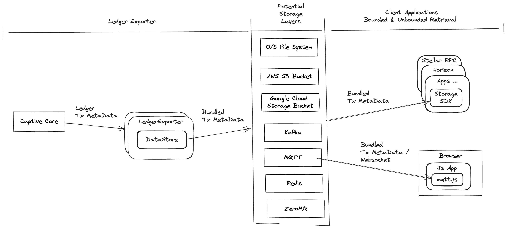

# Ledger Exporter Developer Guide
The ledger exporter is a tool to export Stellar network transaction data to cloud storage in a way that is easy to access.

## Prerequisites
This document assumes that you have installed and can run the ledger exporter, and that you have familiarity with its CLI and configuration. If not, please refer to the [Installation Guide](./README.md).

## Goal
The goal of the ledger exporter is to build an easy-to-use tool to export Stellar network ledger data to a configurable remote data store, such as cloud blob storage.
 - Use cloud storage optimally
 - Minimize network usage to export
 - Make it easy and fast to search for a specific ledger or ledger range

## Architecture
To achieve its goals, the ledger exporter uses the following architecture, which consists of the 3 main components:
- Captive-core to extract raw transaction metadata from the Stellar Network.
- Export manager to bundles and organizes the ledgers to get them ready for export.
- The cloud storage plugin writes to the cloud storage. This is specific to the type of cloud storage, GCS in this case.





## Data Format
- Ledger exporter uses a compact and efficient data format called [XDR](https://developers.stellar.org/docs/learn/encyclopedia/data-format/xdr) (External Data Representation), which is a compact binary format. A Stellar Captive Core instance emits data in this format and the data structure is referred to as `LedgerCloseMeta`. The exporter bundles multiple `LedgerCloseMeta`'s into a single object using a custom XDR structure called `LedgerCloseMetaBatch` which is defined in [Stellar-exporter.x](https://github.com/stellar/go/blob/master/xdr/Stellar-exporter.x).

- The metadata for the same batch is also stored alongside each exported object. Supported metadata is defined in [metadata.go](https://github.com/stellar/go/blob/master/support/datastore/metadata.go). 

- Objects are compressed before uploading using the [zstd](http://facebook.github.io/zstd/) (zstandard) compression algorithm to optimize network usage and storage needs.

## Data Storage
- An example implementation of `DataStore` for GCS, Google Cloud Storage. This plugin is located in the [support](https://github.com/stellar/go/tree/master/support/datastore) package. 
- The ledger exporter currently implements the interface only for Google Cloud Storage (GCS). The [GCS plugin](https://github.com/stellar/go/blob/master/support/datastore/gcs_datastore.go) uses GCS-specific behaviors like conditional puts, automatic retry, metadata, and CRC checksum.

## Build and Run using Docker
The Dockerfile contains all the necessary dependencies (e.g., Stellar-core) required to run the ledger exporter. 

- Build: To build the Docker container, use the provided [Makefile](./Makefile). Simply run make `make docker-build` to build a new container after making any changes.

- Run: For instructions on running the Docker container, refer to the [Installation Guide](./README.md).

## Running Integration Tests:
from top directory of stellar/go repo, run go test to launch ledger exporter integration
tests.

`LEDGEREXPORTER_INTEGRATION_TESTS_ENABLED=true` is required environment variable to allow
tests to run.

Optional, tests will try to run `stellar-core` from o/s PATH for captive core, if not resolvable, then set `LEDGEREXPORTER_INTEGRATION_TESTS_CAPTIVE_CORE_BIN=/path/to/stellar-core` 

Optional, can override the version of quickstart used to run standalone stellar network, `LEDGEREXPORTER_INTEGRATION_TESTS_QUICKSTART_IMAGE=docker.io/stellar/quickstart:<tag>`. Ideally don't need to change this, but is available.

```
$ LEDGEREXPORTER_INTEGRATION_TESTS_ENABLED=true go test -v -race -run TestLedgerExporterTestSuite ./exp/services/ledgerexporter/...
```

## Adding support for a new storage type
Support for different data storage types are encapsulated as 'plugins', which are implementation of `DataStore` interface in a go package. To add a data storage plugin based on a new storage type (e.g. AWS S3), follow these steps:

- A data storage plugin must implement the [DataStore](https://github.com/stellar/go/blob/master/support/datastore/datastore.go) interface.
- Add support for new datastore-specific features. Implement any datastore-specific custom logic. Different datastores have different ways of handling 
  - race conditions
  - automatic retries
  - metadata storage, etc.
- Add the new datastore to the factory function [NewDataStore](https://github.com/stellar/go/blob/master/support/datastore/datastore.go).
- Add a [config](./config.example.toml) section for the new storage type. This may include configurations like destination, authentication information etc.
- An emulator such as a GCS emulator [fake-gcs-server](https://github.com/fsouza/fake-gcs-server) can be used for testing without connecting to real cloud storage.

### Design DOs and DONTs
- Multiple exporters should be able to run in parallel without the need for explicit locking or synchronization.
- Exporters when restarted do not have any memory of prior operation and rely on the already exported data as much as possible to decide where to resume.

## Using exported data
The exported data in storage can be used in the ETL pipeline to gather analytics and reporting. To write a tool that consumes exported data you can use Stellar ingestion library's `ledgerbackend` package. This package includes a ledger backend called [BufferedStorageBackend](https://github.com/stellar/go/blob/master/ingest/ledgerbackend/buffered_storage_backend.go),
which imports data from the storage and validates it. For more details, refer to the ledgerbackend [documentation](https://github.com/stellar/go/tree/master/ingest/ledgerbackend).

## Contributing
For information on how to contribute, please refer to our [Contribution Guidelines](https://github.com/stellar/go/blob/master/CONTRIBUTING.md).
